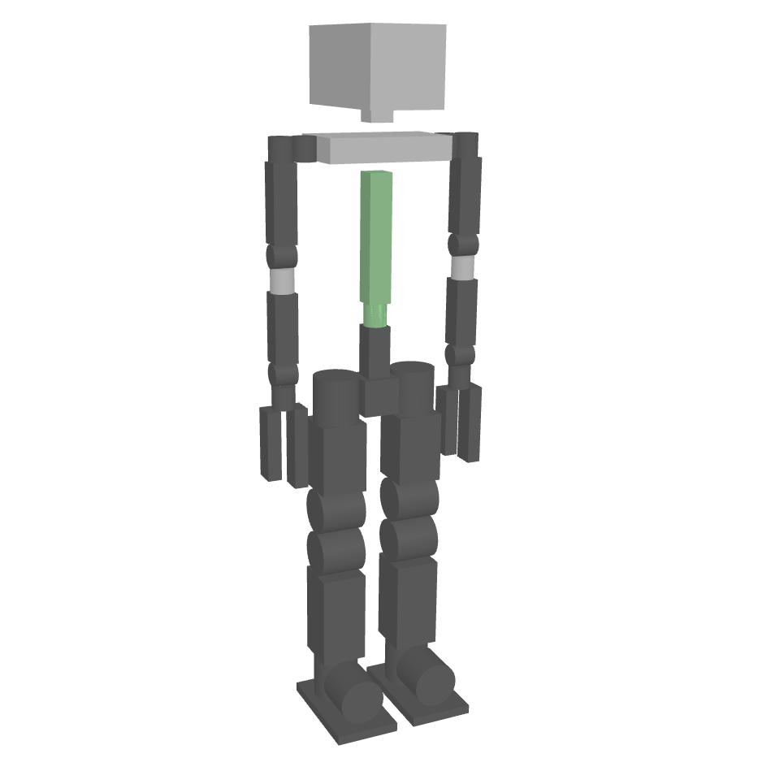

# Awesome Robot Descriptions 

A curated list of awesome robot descriptions in URDF or MJCF formats.

## Contents

* [Robot Descriptions](#robot-descriptions)
    * [Arms](#arms)
    * [Bipeds](#bipeds)
    * [Dual Arms](#dual-arms)
    * [Drones](#drones)
    * [Educational](#educational)
    * [End Effectors](#end-effectors)
    * [Mobile Manipulators](#mobile-manipulators)
    * [Humanoids](#humanoids)
    * [Quadrupeds](#quadrupeds)
    * [Wheeled](#wheeled)
* [Gallery](#gallery)
* [Related Awesome Lists](#related-awesome-lists)
* [Add a Description to the List](#add-a-description-to-the-list)

## Robot Descriptions

### Arms

| Name | Maker | Formats | License | Meshes | Inertias | Collisions |
|------|-------|---------|---------|--------|----------|------------|
| e.DO | Comau | [URDF](https://github.com/Comau/eDO_description) | BSD-3-Clause | ✔️ | ✔️ | ✔️ |
| Gen2 (URDF) | Kinova | [URDF](https://github.com/Gepetto/example-robot-data/tree/master/robots/kinova_description) | BSD-3-Clause | ✔️ | ✔️ | ✔️ |
| Gen3 (MJCF) | Kinova | [MJCF](https://github.com/mathieu-celerier/kinova_mj_description) | BSD-2-Clause | ✔️ | ✔️ | ✔️ |
| iiwa 14 | KUKA | [URDF](https://github.com/RobotLocomotion/drake/tree/master/manipulation/models/iiwa_description) | BSD-3-Clause | ✔️ | ✔️ | ✔️ |
| Panda (MJCF) | Franka Emika | [MJCF](https://github.com/deepmind/mujoco_menagerie/tree/main/franka_emika_panda) | Apache-2.0 | ✔️ | ✔️ | ✔️ |
| Panda (URDF) | Franka Emika | [URDF](https://github.com/Gepetto/example-robot-data/tree/master/robots/panda_description), [Xacro](https://github.com/frankaemika/franka_ros/tree/develop/franka_description) | Apache-2.0 | ✔️ | ✖️ | ✔️ |
| Poppy Ergo Jr | Poppy Project | [URDF](https://github.com/poppy-project/poppy_ergo_jr_description) | GPL-3.0 | ✔️ | ✔️ | ✔️ |
| Sawyer | Rethink Robotics | [Xacro](https://github.com/RethinkRobotics/sawyer_robot/tree/master/sawyer_description) | Apache-2.0 | ✔️ | ✔️ | ✔️ |
| UR 3/5/10 | Universal Robots | [URDF](https://github.com/Gepetto/example-robot-data/blob/master/robots/ur_description/), [Xacro](https://github.com/ros-industrial/universal_robot/blob/kinetic-devel/ur_description/) | Apache-2.0 | ✔️ | ✔️ | ✔️ |
| URe 3/5/10 | Universal Robots | [MJCF](https://github.com/deepmind/mujoco_menagerie/tree/main/universal_robots_ur5e), [URDF](https://github.com/ros-industrial/universal_robot/tree/kinetic-devel/ur_e_description) | BSD-3-Clause | ✔️ | ✔️ | ✔️ |

### Bipeds

| Name | Maker | Formats | License | Meshes | Inertias | Collisions |
|------|-------|---------|---------|--------|----------|------------|
| Bolt | ODRI | [URDF](https://github.com/Gepetto/example-robot-data/tree/master/robots/bolt_description) | BSD-3-Clause | ✔️ | ✔️ | ✔️ |
| Cassie (MJCF) | Agility Robotics | [MJCF](https://github.com/deepmind/mujoco_menagerie/tree/main/agility_cassie) | MIT | ✔️ | ✔️ | ✔️ |
| Cassie (URDF) | Agility Robotics | [URDF](https://github.com/robot-descriptions/cassie_description) | MIT | ✔️ | ✔️ | ✔️ |
| Spryped | Benjamin Bokser | [URDF](https://github.com/bbokser/spryped/tree/master/spryped_urdf_rev06) | GPL-3.0 | ✔️ | ✔️ | ✔️ |
| Upkie | Tast's Robots | [URDF](https://github.com/tasts-robots/upkie_description) | Apache-2.0 | ✔️ | ✔️ | ✔️ |

### Dual Arms

| Name | Maker | Formats | License | Meshes | Inertias | Collisions |
|------|-------|---------|---------|--------|----------|------------|
| Baxter | Rethink Robotics | [URDF](https://github.com/RethinkRobotics/baxter_common/blob/master/baxter_description/urdf/baxter.urdf), [Xacro](https://github.com/RethinkRobotics/baxter_common/blob/master/baxter_description/urdf/baxter.urdf.xacro) | BSD-3-Clause | ✔️ | ✔️ | ✔️ |
| NEXTAGE | Kawada Robotics | [URDF](https://github.com/tork-a/rtmros_nextage/tree/indigo-devel/nextage_description) | BSD | ✔️ | ✔️ | ✔️ |
| Poppy Torso | Pollen Robotics | [URDF](https://github.com/poppy-project/poppy_torso_description) | GPL-3.0 | ✔️ | ✔️ | ✔️ |
| YuMi | ABB | [URDF](https://github.com/OrebroUniversity/yumi/tree/master/yumi_description) | BSD-2-Clause | ✔️ | ✔️ | ✔️ |

### Drones

| Name | Maker | Formats | License | Meshes | Inertias | Collisions |
|------|-------|---------|---------|--------|----------|------------|
| Crazyflie 2.0 | Bitcraze | [URDF](https://github.com/utiasDSL/gym-pybullet-drones/tree/master/gym_pybullet_drones/assets) | MIT | ✔️ | ✔️ | ✔️ |

### Educational

| Name | Formats | License | Meshes | Inertias | Collisions |
|------|---------|---------|--------|----------|------------|
| Double Pendulum | [URDF](https://github.com/Gepetto/example-robot-data/tree/master/robots/double_pendulum_description) | BSD-3-Clause | ✔️ | ✔️ | ✔️ |
| FingerEdu | [URDF](https://github.com/Gepetto/example-robot-data/tree/master/robots/finger_edu_description) | BSD-3-Clause | ✔️ | ✔️ | ✔️ |
| Simple Humanoid | [URDF](https://github.com/laas/simple_humanoid_description) | BSD-2-Clause | ✔️ | ✔️ | ✖️ |

### End Effectors

| Name | Maker | Formats | License | Meshes | Inertias | Collisions |
|------|-------|---------|---------|--------|----------|------------|
| Allegro Hand | Wonik Robotics | [URDF](https://github.com/RobotLocomotion/drake/tree/master/manipulation/models/allegro_hand_description) | BSD | ✔️ | ✔️ | ✔️ |
| BarrettHand | Barrett Technology | [URDF](https://github.com/jhu-lcsr-attic/bhand_model/tree/master/robots) | BSD | ✖️ | ✔️ | ✔️ |
| Robotiq 2F-85 | Robotiq | [MJCF](https://github.com/deepmind/mujoco_menagerie/tree/main/robotiq_2f85), [URDF](https://github.com/a-price/robotiq_arg85_description), [Xacro](https://github.com/ros-industrial/robotiq/tree/kinetic-devel/robotiq_2f_85_gripper_visualization) | BSD-2-Clause | ✔️ | ✔️ | ✔️ |
| Shadow Hand E3M5 | The Shadow Robot Company | [MJCF](https://github.com/deepmind/mujoco_menagerie/tree/main/shadow_hand) | Apache-2.0 | ✔️ | ✔️ | ✔️ |
| WSG 50 | SCHUNK | [SDF](https://github.com/RobotLocomotion/drake/tree/master/manipulation/models/wsg_50_description) | BSD-3-Clause | ✔️ | ✔️ | ✔️ |

### Mobile Manipulators

| Name | Maker | Formats | License | Meshes | Inertias | Collisions |
|------|-------|---------|---------|--------|----------|------------|
| Eve R3 | Halodi | [URDF](https://github.com/Halodi/halodi-robot-models) | Apache-2.0 | ✔️ | ✔️ | ✔️ |
| Fetch | Fetch Robotics | [URDF](https://github.com/openai/roboschool/tree/master/roboschool/models_robot/fetch_description) | MIT | ✔️ | ✔️ | ✔️ |
| Ginger | Paaila Technology | [URDF](https://github.com/Rayckey/GingerURDF) | BSD | ✔️ | ✔️ | ✔️ |
| Pepper | SoftBank Robotics | [URDF](https://github.com/jrl-umi3218/pepper_description) | BSD-2-Clause | ✔️ | ✔️ | ✔️ |
| PR2 | Willow Garage | [URDF](https://github.com/ankurhanda/robot-assets/tree/master/urdfs/robots/pr2), [Xacro](https://github.com/PR2/pr2_common/blob/melodic-devel/pr2_description/urdf/common.xacro) | BSD | ✔️ | ✔️ | ✔️ |
| Reachy | Pollen Robotics | [URDF](https://github.com/aubrune/reachy_description) | Apache-2.0 | ✔️ | ✔️ | ✔️ |
| Ridgeback | Clearpath Robotics | [Xacro](https://github.com/ridgeback/ridgeback_manipulation/tree/melodic-devel/ridgeback_manipulation_description) | BSD | ✔️ | ✔️ | ✔️ |
| Stretch RE1 | Hello Robot | [Xacro](https://github.com/hello-robot/stretch_ros/tree/master/stretch_description) | CC-BY-NC-SA-4.0 | ✔️ | ✔️ | ✔️ |
| TIAGo | PAL Robotics | [URDF](https://github.com/Gepetto/example-robot-data/tree/master/robots/tiago_description) | CC-BY-NC-ND-3.0 | ✔️ | ✔️ | ✔️ |

### Humanoids

| Name | Maker | Formats | License | Meshes | Inertias | Collisions |
|------|-------|---------|---------|--------|----------|------------|
| Atlas DRC (v3) | Boston Dynamics | [URDF](https://github.com/RobotLocomotion/drake/tree/master/examples/atlas) | BSD-3-Clause | ✔️ | ✔️ | ✔️ |
| Atlas v4 | Boston Dynamics | [URDF](https://github.com/openai/roboschool/tree/1.0.49/roboschool/models_robot/atlas_description) | MIT | ✔️ | ✔️ | ✔️ |
| Digit | Agility Robotics | [URDF](https://github.com/adubredu/DigitRobot.jl) | ✖️ | ✔️ | ✔️ | ✔️ |
| iCub | IIT | [URDF](https://github.com/robotology/icub-models/tree/master/iCub) | CC-BY-SA-4.0 | ✔️ | ✔️ | ✔️ |
| JAXON | JSK | [COLLADA](https://github.com/stephane-caron/openrave_models/tree/master/JAXON), [URDF](https://github.com/robot-descriptions/jaxon_description), [VRML](https://github.com/start-jsk/rtmros_choreonoid/tree/master/jvrc_models/JAXON_JVRC) | CC-BY-SA-4.0 | ✔️ | ✔️ | ✔️ |
| JVRC-1 | AIST | [MJCF](https://github.com/isri-aist/jvrc_mj_description/), [URDF](https://github.com/stephane-caron/jvrc_description) | BSD-2-Clause | ✔️ | ✔️ | ✔️ |
| NAO | SoftBank Robotics | [URDF](https://github.com/ros-naoqi/nao_robot/tree/master/nao_description/urdf/naoV50_generated_urdf), [Xacro](https://github.com/ros-naoqi/nao_robot/tree/master/nao_description/) | BSD-3-Clause | [:heavy_minus_sign:](https://github.com/ros-naoqi/nao_meshes#readme) | ✔️ | ✔️ |
| Robonaut 2 | NASA JSC Robotics | [URDF](https://github.com/gkjohnson/nasa-urdf-robots/tree/master/r2_description) | NASA-1.3 | ✔️ | ✔️ | ✔️ |
| Romeo | Aldebaran Robotics | [URDF](https://github.com/ros-aldebaran/romeo_robot/tree/master/romeo_description) | BSD-3-Clause | ✔️ | ✔️ | ✔️ |
| SigmaBan | Rhoban | [URDF](https://github.com/Rhoban/sigmaban_urdf) | MIT | ✔️ | ✔️ | ✔️ |
| TALOS | PAL Robotics | [URDF](https://github.com/stack-of-tasks/talos-data) | LGPL-3.0 | ✔️ | ✔️ | ✔️ |
| Valkyrie | NASA JSC Robotics | [URDF](https://github.com/gkjohnson/nasa-urdf-robots/tree/master/val_description/model), [Xacro](https://gitlab.com/nasa-jsc-robotics/val_description) | NASA-1.3 | ✔️ | ✔️ | ✔️ |
| WALK-MAN | IIT | [Xacro](https://github.com/ADVRHumanoids/iit-walkman-ros-pkg/tree/master/walkman_urdf) | BSD-3-Clause | ✔️ | ✔️ | ✔️ |

### Quadrupeds

| Name | Maker | Formats | License | Meshes | Inertias | Collisions |
|------|-------|---------|---------|--------|----------|------------|
| A1 | UNITREE Robotics | [MJCF](https://github.com/unitreerobotics/unitree_mujoco/tree/main/data/a1/xml), [URDF](https://github.com/unitreerobotics/unitree_ros/tree/master/robots/a1_description) | MPL-2.0 | ✔️ | ✔️ | ✔️ |
| Aliengo | UNITREE Robotics | [MJCF](https://github.com/unitreerobotics/unitree_mujoco/tree/main/data/aliengo/xml), [URDF](https://github.com/unitreerobotics/unitree_ros/tree/master/robots/aliengo_description) | MPL-2.0 | ✔️ | ✔️ | ✔️ |
| ANYmal B | ANYbotics | [MJCF](https://github.com/deepmind/mujoco_menagerie/tree/main/anybotics_anymal_b), [URDF](https://github.com/ANYbotics/anymal_b_simple_description) | BSD-3-Clause | ✔️ | ✔️ | ✔️ |
| ANYmal C | ANYbotics | [MJCF](https://github.com/deepmind/mujoco_menagerie/tree/main/anybotics_anymal_c), [URDF](https://github.com/ANYbotics/anymal_c_simple_description) | BSD-3-Clause | ✔️ | ✔️ | ✔️ |
| Go1 | UNITREE Robotics | [MJCF](https://github.com/unitreerobotics/unitree_mujoco/tree/main/data/go1/xml), [URDF](https://github.com/unitreerobotics/unitree_mujoco/tree/main/data/go1/urdf) | BSD-3-Clause | ✔️ | ✔️ | ✔️ |
| HyQ | IIT | [URDF](https://github.com/Gepetto/example-robot-data/tree/master/robots/hyq_description) | Apache-2.0 | ✔️ | ✔️ | ✔️ |
| Laikago | UNITREE Robotics | [MJCF](https://github.com/unitreerobotics/unitree_mujoco/tree/main/data/laikago/xml), [URDF](https://github.com/unitreerobotics/unitree_ros/tree/master/robots/laikago_description) | MPL-2.0 | ✔️ | ✔️ | ✔️ |
| Mini Cheetah | MIT | [URDF](https://github.com/Derek-TH-Wang/mini_cheetah_urdf) | BSD | ✔️ | ✔️ | ✔️ |
| Minitaur | Ghost Robotics | [URDF](https://github.com/bulletphysics/bullet3/blob/master/data/quadruped/minitaur.urdf) | BSD-2-Clause | ✔️ | ✔️ | ✔️ |
| Solo | ODRI | [URDF](https://github.com/Gepetto/example-robot-data/tree/master/robots/solo_description) | BSD-3-Clause | ✔️ | ✔️ | ✔️ |
| Spot | Boston Dynamics | [Xacro](https://github.com/clearpathrobotics/spot_ros/tree/master/spot_description) | ✖️ | ✔️ | ✖️ | ✔️ |

### Wheeled

| Name | Maker | Formats | License | Meshes | Inertias | Collisions |
|------|-------|---------|---------|--------|----------|------------|
| Boxer | Clearpath Robotics | [Xacro](https://github.com/boxer-cpr/boxer/tree/noetic-devel/boxer_description) | BSD-3-Clause | ✔️ | ✔️ | ✔️ |
| Dingo | Clearpath Robotics | [Xacro](https://github.com/dingo-cpr/dingo/tree/melodic-devel/dingo_description) | BSD-3-Clause | ✔️ | ✔️ | ✔️ |
| Husky | Clearpath Robotics | [Xacro](https://github.com/husky/husky/tree/noetic-devel/husky_description) | BSD-3-Clause | ✔️ | ✔️ | ✔️ |
| Jackal | Clearpath Robotics | [Xacro](https://github.com/jackal/jackal/tree/noetic-devel/jackal_description) | BSD-3-Clause | ✔️ | ✔️ | ✔️ |
| Ridgeback | Clearpath Robotics | [Xacro](https://github.com/ridgeback/ridgeback/tree/melodic-devel/ridgeback_description) | BSD-3-Clause | ✔️ | ✔️ | ✔️ |

## Gallery

|  |  |  |  |  |
|--|--|--|--|--|
|  |  |  |  |  |
|  |  |  |  | |
|  |  |  |  |  |
|  |  |  |  | |
|  |  |  |  | |
|  |  |  |  |  |
|  |  |  |  |  | |
|  |  |  |  |  |

## Related Awesome Lists

* [Awesome Homemade Robots](https://github.com/tasts-robots/awesome-homemade-robots)
* [Awesome URDF](https://github.com/ami-iit/awesome-urdf)

## Add a Description to the List

New robot descriptions are welcome! Check out the [guidelines](CONTRIBUTING.md), then open a PR.
