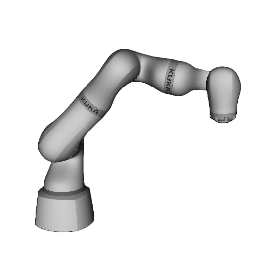

# Awesome Robot Descriptions 

A curated list of awesome robot descriptions in URDF, Xacro or MJCF formats.

## Contents

- [Robot Descriptions](#robot-descriptions)
  - [Arms](#arms)
  - [Bipeds](#bipeds)
  - [Dual Arms](#dual-arms)
  - [Drones](#drones)
  - [Educational](#educational)
  - [End Effectors](#end-effectors)
  - [Mobile Manipulators](#mobile-manipulators)
  - [Humanoids](#humanoids)
  - [Quadrupeds](#quadrupeds)
  - [Wheeled](#wheeled)
- [Gallery](#gallery)
- [Related Awesome Lists](#related-awesome-lists)
- [Add a Description to the List](#add-a-description-to-the-list)

## Robot Descriptions

### Arms

| Name | Maker | Formats | License | Visuals | Inertias | Collisions |
|------|-------|---------|---------|---------|----------|------------|
| e.DO | Comau | [URDF](https://github.com/ianathompson/eDO_description) | [BSD-3-Clause](https://github.com/ianathompson/eDO_description/blob/17b3f92f834746106d6a4befaab8eeab3ac248e6/LICENSE) | ✔️ | ✔️ | ✔️ |
| FR3 | Franka Robotics | [MJCF](https://github.com/google-deepmind/mujoco_menagerie/tree/main/franka_fr3) | Apache-2.0 | ✔️ | ✔️ | ✔️ |
| Gen2 | Kinova | [URDF](https://github.com/Gepetto/example-robot-data/tree/master/robots/kinova_description) | BSD-3-Clause | ✔️ | ✔️ | ✔️ |
| Gen3 | Kinova | [MJCF](https://github.com/mathieu-celerier/kinova_mj_description) | BSD-2-Clause | ✔️ | ✔️ | ✔️ |
| Gen3 | Kinova | [URDF](https://github.com/Kinovarobotics/ros2_kortex/tree/main/kortex_description/robots) | BSD-3-Clause | ✔️ | ✔️ | ✔️ |
| Gen3 Lite | Kinova | [URDF](https://github.com/Kinovarobotics/ros2_kortex/tree/main/kortex_description/robots) | BSD-3-Clause | ✔️ | ✔️ | ✔️ |
| iiwa 7 | KUKA | [URDF](https://github.com/facebookresearch/differentiable-robot-model/blob/main/diff_robot_data/kuka_iiwa/urdf) | MIT | ✔️ | ✔️ | ✔️ |
| iiwa 14 | KUKA | [URDF](https://github.com/RobotLocomotion/models/tree/master/iiwa_description/urdf), [MJCF](https://github.com/google-deepmind/mujoco_menagerie/tree/main/kuka_iiwa_14) | BSD-3-Clause | ✔️ | ✔️ | ✔️ |
| Lite 6 | UFACTORY | [Xacro](https://github.com/xArm-Developer/xarm_ros2/blob/master/xarm_description/urdf/lite6/lite6.urdf.xacro), [MJCF](https://github.com/google-deepmind/mujoco_menagerie/tree/main/ufactory_lite6) | BSD-3-Clause | ✔️ | ✔️ | ✔️ |
| Low-Cost Robot Arm | Alexander Koch | [URDF](https://github.com/tc-huang/low_cost_robot/tree/6c42a82763c2ff056832b87314324b88faf51b61/ros2_ws/src/low_cost_robot_description) | MIT | ✔️ | ✔️ | ✔️ |
| Med 7 | KUKA | [Xacro](https://github.com/lbr-stack/lbr_fri_ros2_stack/tree/rolling/lbr_description/urdf/med7) | Apache-2.0 | ✔️ | ✔️ | ✔️ |
| Med 14 | KUKA | [Xacro](https://github.com/lbr-stack/lbr_fri_ros2_stack/tree/rolling/lbr_description/urdf/med14) | Apache-2.0 | ✔️ | ✔️ | ✔️ |
| M-710iC | FANUC | [URDF](https://github.com/robot-descriptions/fanuc_m710ic_description), [Xacro](https://github.com/ros-industrial/fanuc/tree/melodic-devel/fanuc_m710ic_support) | BSD-3-Clause | ✔️ | ✖️ | ✔️ |
| Panda | Franka Robotics | [MJCF](https://github.com/deepmind/mujoco_menagerie/tree/main/franka_emika_panda) | Apache-2.0 | ✔️ | ✔️ | ✔️ |
| Panda | Franka Robotics | [URDF](https://github.com/Gepetto/example-robot-data/tree/master/robots/panda_description), [Xacro](https://github.com/frankaemika/franka_ros/tree/develop/franka_description) | Apache-2.0 | ✔️ | ✖️ | ✔️ |
| PiPER | AgileX | [MJCF](https://github.com/google-deepmind/mujoco_menagerie/tree/main/agilex_piper), [URDF](https://github.com/agilexrobotics/Piper_ros/tree/ros-noetic-no-aloha/src/piper_description/urdf) | MIT | ✔️ | ✔️ | ✔️ |
| Poppy Ergo Jr | Poppy Project | [URDF](https://github.com/poppy-project/poppy_ergo_jr_description) | GPL-3.0 | ✔️ | ✔️ | ✔️ |
| Sawyer | Rethink Robotics | [Xacro](https://github.com/RethinkRobotics/sawyer_robot/tree/master/sawyer_description), [MJCF](https://github.com/google-deepmind/mujoco_menagerie/tree/main/rethink_robotics_sawyer) | Apache-2.0 | ✔️ | ✔️ | ✔️ |
| SO-ARM 100 | The Robot Studio | [URDF](https://github.com/TheRobotStudio/SO-ARM100/blob/main/URDF/SO_5DOF_ARM100_8j_URDF.SLDASM/urdf/SO_5DOF_ARM100_8j_URDF.SLDASM.urdf) | Apache-2.0 | ✔️ | ✔️ | ✔️ |
| UR10 | Universal Robots | [URDF](https://github.com/Gepetto/example-robot-data/blob/master/robots/ur_description/urdf/ur10_robot.urdf), [Xacro](https://github.com/ros-industrial/universal_robot/blob/kinetic-devel/ur_description/urdf/ur10.urdf.xacro) | Apache-2.0 | ✔️ | ✔️ | ✔️ |
| UR10e | Universal Robots | [MJCF](https://github.com/deepmind/mujoco_menagerie/tree/main/universal_robots_ur10e), [Xacro](https://github.com/ros-industrial/universal_robot/blob/kinetic-devel/ur_e_description/urdf/ur10e.urdf.xacro) | BSD-3-Clause | ✔️ | ✔️ | ✔️ |
| UR3 | Universal Robots | [URDF](https://github.com/Gepetto/example-robot-data/blob/master/robots/ur_description/urdf/ur3_robot.urdf), [Xacro](https://github.com/ros-industrial/universal_robot/blob/kinetic-devel/ur_description/urdf/ur3.urdf.xacro) | Apache-2.0 | ✔️ | ✔️ | ✔️ |
| UR3e | Universal Robots | [Xacro](https://github.com/ros-industrial/universal_robot/blob/kinetic-devel/ur_e_description/urdf/ur3e.urdf.xacro) | BSD-3-Clause | ✔️ | ✔️ | ✔️ |
| UR5 | Universal Robots | [URDF](https://github.com/Gepetto/example-robot-data/blob/master/robots/ur_description/urdf/ur5_robot.urdf), [Xacro](https://github.com/ros-industrial/universal_robot/blob/kinetic-devel/ur_description/urdf/ur5.urdf.xacro) | Apache-2.0 | ✔️ | ✔️ | ✔️ |
| UR5e | Universal Robots | [MJCF](https://github.com/deepmind/mujoco_menagerie/tree/main/universal_robots_ur5e), [Xacro](https://github.com/ros-industrial/universal_robot/blob/kinetic-devel/ur_e_description/urdf/ur5e.urdf.xacro) | BSD-3-Clause | ✔️ | ✔️ | ✔️ |
| ViperX 300 | Trossen Robotics | [Xacro](https://github.com/Interbotix/interbotix_ros_manipulators/blob/main/interbotix_ros_xsarms/interbotix_xsarm_descriptions/urdf/vx300s.urdf.xacro), [MJCF](https://github.com/google-deepmind/mujoco_menagerie/tree/main/trossen_vx300s) | BSD-3-Clause | ✔️ | ✔️ | ✔️ |
| WidowX 250 | Trossen Robotics | [MJCF](https://github.com/google-deepmind/mujoco_menagerie/tree/main/trossen_wx250s) | BSD-3-Clause | ✔️ | ✔️ | ✔️ |
| xArm5 | UFACTORY | [Xacro](https://github.com/xArm-Developer/xarm_ros2/blob/master/xarm_description/urdf/xarm5/xarm5.urdf.xacro) | BSD-3-Clause | ✔️ | ✔️ | ✔️ |
| xArm6 | UFACTORY | [Xacro](https://github.com/xArm-Developer/xarm_ros2/blob/master/xarm_description/urdf/xarm6/xarm6.urdf.xacro) | BSD-3-Clause | ✔️ | ✔️ | ✔️ |
| xArm7 | UFACTORY | [Xacro](https://github.com/xArm-Developer/xarm_ros2/blob/master/xarm_description/urdf/xarm7/xarm7.urdf.xacro), [MJCF](https://github.com/google-deepmind/mujoco_menagerie/tree/main/ufactory_xarm7) | BSD-3-Clause | ✔️ | ✔️ | ✔️ |
| Z1 | UNITREE Robotics | [URDF](https://github.com/unitreerobotics/unitree_ros/blob/master/robots/z1_description/xacro/z1.urdf) | BSD-3-Clause | ✔️ | ✔️ | ✔️ |

### Bipeds

| Name | Maker | Formats | License | Visuals | Inertias | Collisions |
|------|-------|---------|---------|---------|----------|------------|
| Bolt | ODRI | [URDF](https://github.com/Gepetto/example-robot-data/tree/master/robots/bolt_description) | BSD-3-Clause | ✔️ | ✔️ | ✔️ |
| BD-X | Disney | [URDF](https://github.com/rimim/AWD/blob/main/awd/data/assets/go_bdx/go_bdx.urdf) [MJCF](https://github.com/rimim/AWD/blob/main/awd/data/assets/go_bdx/go_bdx.xml) | NVIDIA License | ✔️ | ✔️ | ✔️ |
| Cassie | Agility Robotics | [URDF](https://github.com/robot-descriptions/cassie_description), [MJCF](https://github.com/deepmind/mujoco_menagerie/tree/main/agility_cassie) | MIT | ✔️ | ✔️ | ✔️ |
| OP3 | Robotis | [MJCF](https://github.com/google-deepmind/mujoco_menagerie/tree/main/robotis_op3) | Apache-2.0 | ✔️ | ✔️ | ✔️ |
| Rhea | Gabrael Levine | [URDF](https://github.com/G-Levine/rhea_description) | MIT | ✔️ | ✖️ | ✔️ |
| Spryped | Benjamin Bokser | [URDF](https://github.com/bbokser/spryped/tree/master/spryped_urdf_rev06) | GPL-3.0 | ✔️ | ✔️ | ✔️ |
| Upkie | Stéphane Caron | [URDF](https://github.com/upkie/upkie_description) | Apache-2.0 | ✔️ | ✔️ | ✔️ |

### Dual Arms

| Name | Maker | Formats | License | Visuals | Inertias | Collisions |
|------|-------|---------|---------|---------|----------|------------|
| Baxter | Rethink Robotics | [URDF](https://github.com/RethinkRobotics/baxter_common/blob/master/baxter_description/urdf/baxter.urdf), [Xacro](https://github.com/RethinkRobotics/baxter_common/blob/master/baxter_description/urdf/baxter.urdf.xacro) | BSD-3-Clause | ✔️ | ✔️ | ✔️ |
| Dual iiwa 14 | KUKA | [URDF](https://github.com/RobotLocomotion/models/blob/master/iiwa_description/urdf/dual_iiwa14_polytope_collision.urdf), [Xacro](https://github.com/RobotLocomotion/models/blob/master/iiwa_description/urdf/dual_iiwa14_polytope_collision.urdf.xacro) | BSD-3-Clause | ✔️ | ✔️ | ✔️ |
| NEXTAGE | Kawada Robotics | [URDF](https://github.com/tork-a/rtmros_nextage/tree/indigo-devel/nextage_description) | BSD | ✔️ | ✔️ | ✔️ |
| Poppy Torso | Pollen Robotics | [URDF](https://github.com/poppy-project/poppy_torso_description) | GPL-3.0 | ✔️ | ✔️ | ✔️ |
| Sciurus17 | RT Corporation | [Xacro](https://github.com/rt-net/sciurus17_description) | ✖️ | ✔️ | ✔️ | ✔️ |
| YuMi | ABB | [URDF](https://github.com/OrebroUniversity/yumi/tree/master/yumi_description) | BSD-2-Clause | ✔️ | ✔️ | ✔️ |

### Drones

| Name | Maker | Formats | License | Visuals | Inertias | Collisions |
|------|-------|---------|---------|---------|----------|------------|
| Crazyflie 1.0 | Bitcraze | [Xacro](https://github.com/whoenig/crazyflie_ros/tree/master/crazyflie_description) | MIT | ✔️ | ✔️ | ✖️ |
| Crazyflie 2.0 | Bitcraze | [URDF](https://github.com/utiasDSL/gym-pybullet-drones/tree/master/gym_pybullet_drones/assets), [MJCF](https://github.com/google-deepmind/mujoco_menagerie/tree/main/bitcraze_crazyflie_2) | MIT | ✔️ | ✔️ | ✔️ |
| X2 | Skydio | [MJCF](https://github.com/google-deepmind/mujoco_menagerie/tree/main/skydio_x2), [URDF](https://github.com/lvjonok/skydio_x2_description/blob/master/urdf/skydio_x2.urdf) | Apache-2.0 | ✔️ | ✔️ | ✔️ |
| Ingenuity | NASA JPL | [URDF](https://github.com/david-dorf/perseverance-ingenuity-urdfs/tree/main/ingenuity) | Apache-2.0 | ✔️ | ✔️ | ✔️ |

### Educational

| Name | Formats | License | Visuals | Inertias | Collisions |
|------|---------|---------|---------|----------|------------|
| Double Pendulum | [URDF](https://github.com/Gepetto/example-robot-data/tree/master/robots/double_pendulum_description) | BSD-3-Clause | ✔️ | ✔️ | ✔️ |
| FingerEdu | [URDF](https://github.com/Gepetto/example-robot-data/tree/master/robots/finger_edu_description) | BSD-3-Clause | ✔️ | ✔️ | ✔️ |
| Simple Humanoid | [URDF](https://github.com/laas/simple_humanoid_description) | BSD-2-Clause | ✔️ | ✔️ | ✖️ |
| TriFingerEdu | [URDF](https://github.com/facebookresearch/differentiable-robot-model/tree/main/diff_robot_data/trifinger_edu_description) | MIT | ✔️ | ✔️ | ✔️ |

### End Effectors

| Name | Maker | Formats | License | Visuals | Inertias | Collisions |
|------|-------|---------|---------|---------|----------|------------|
| Ability Hand | PSYONIC, Inc. | [MJCF](https://github.com/psyonicinc/ability-hand-api/tree/master/python/ah_simulators/mujoco_xml), [URDF](https://github.com/psyonicinc/ability-hand-api/tree/master/URDF) | [MIT](https://github.com/psyonicinc/ability-hand-api/blob/d82ca9db87fab43ac4cdd4b5144ea1080b51bab6/LICENSE) | ✔️ | ✔️ | ✔️ |
| Allegro Hand | Wonik Robotics | [URDF](https://github.com/RobotLocomotion/models/tree/master/allegro_hand_description/urdf), [MJCF](https://github.com/google-deepmind/mujoco_menagerie/tree/main/wonik_allegro) | BSD | ✔️ | ✔️ | ✔️ |
| BarrettHand | Barrett Technology | [URDF](https://github.com/jhu-lcsr-attic/bhand_model/tree/master/robots) | BSD | ✖️ | ✔️ | ✔️ |
| DexHand | The Robot Studio | [URDF](https://github.com/iotdesignshop/dexhand_description/tree/main/urdf) | CC-BY-NC-SA | ✔️ | ✔️ | ✔️ |
| LEAP Hand v1 | Carnegie Mellon University | [URDF](https://github.com/leap-hand/LEAP_Hand_Sim/blob/150bc3d4b61fd6619193ba5a8ef209f3609ced89/assets/leap_hand/robot.urdf) | MIT | ✔️ | ✔️ | ✔️ |
| Robotiq 2F-85 | Robotiq | [MJCF](https://github.com/deepmind/mujoco_menagerie/tree/main/robotiq_2f85), [URDF](https://github.com/a-price/robotiq_arg85_description), [Xacro](https://github.com/ros-industrial/robotiq/tree/kinetic-devel/robotiq_2f_85_gripper_visualization) | BSD-2-Clause | ✔️ | ✔️ | ✔️ |
| SCHUNK EGP | SCHUNK | [Xacro](https://github.com/SCHUNK-SE-Co-KG/schunk_description/blob/f88f51309a1d3879a90fe2623bc153c0af835675/egp_description/urdf/egp.xacro) | GPL-3.0 | ✔️ | ✔️ | ✔️ |
| SCHUNK EGU 50 | SCHUNK | [Xacro](https://github.com/SCHUNK-SE-Co-KG/schunk_description/blob/f88f51309a1d3879a90fe2623bc153c0af835675/egu_description/urdf/egu_50.xacro) | GPL-3.0 | ✔️ | ✔️ | ✔️ |
| SCHUNK PZN-plus | SCHUNK | [Xacro](https://github.com/SCHUNK-SE-Co-KG/schunk_description/blob/f88f51309a1d3879a90fe2623bc153c0af835675/pzn_plus_description/urdf/pzn_plus.xacro) | GPL-3.0 | ✔️ | ✔️ | ✔️ |
| SCHUNK PZV 64 | SCHUNK | [Xacro](https://github.com/SCHUNK-SE-Co-KG/schunk_description/blob/f88f51309a1d3879a90fe2623bc153c0af835675/pzv_64_description/urdf/pzv_64.xacro) | GPL-3.0 | ✔️ | ✔️ | ✔️ |
| SCHUNK SVH Hand | SCHUNK | [Xacro](https://github.com/SCHUNK-SE-Co-KG/schunk_svh_ros_driver/blob/e35bebf9e2137a11f2677e6e0f54f66a03348afb/schunk_svh_description/urdf/svh.urdf.xacro) | GPL-3.0 | ✔️ | ✔️ | ✔️ |
| SCHUNK WSG 50 | SCHUNK | [SDF](https://github.com/RobotLocomotion/models/tree/master/wsg_50_description) | BSD-3-Clause | ✔️ | ✔️ | ✔️ |
| Shadow DEX-EE | The Shadow Robot Company | [MJCF](https://github.com/deepmind/mujoco_menagerie/tree/main/shadow_dexee) | Apache-2.0 | ✔️ | ✔️ | ✔️ |
| Shadow Hand E3M5 | The Shadow Robot Company | [MJCF](https://github.com/deepmind/mujoco_menagerie/tree/main/shadow_hand) | Apache-2.0 | ✔️ | ✔️ | ✔️ |
| UMI Gripper | UMI project | [MJCF](https://github.com/google-deepmind/mujoco_menagerie/tree/main/umi_gripper) | MIT | ✔️ | ✔️ | ✔️ |

### Mobile Manipulators

| Name | Maker | Formats | License | Visuals | Inertias | Collisions |
|------|-------|---------|---------|---------|----------|------------|
| Eve R3 | Halodi | [URDF](https://github.com/Halodi/halodi-robot-models) | Apache-2.0 | ✔️ | ✔️ | ✔️ |
| Fetch | Fetch Robotics | [URDF](https://github.com/openai/roboschool/tree/master/roboschool/models_robot/fetch_description) | MIT | ✔️ | ✔️ | ✔️ |
| Ginger | Paaila Technology | [URDF](https://github.com/Rayckey/GingerURDF) | BSD | ✔️ | ✔️ | ✔️ |
| Google Robot | Google | [MJCF](https://github.com/google-deepmind/mujoco_menagerie/blob/main/google_robot/) | Apache-2.0 | ✔️ | ✔️ | ✔️ |
| Pepper | SoftBank Robotics | [URDF](https://github.com/jrl-umi3218/pepper_description) | BSD-2-Clause | ✔️ | ✔️ | ✔️ |
| PR2 | Willow Garage | [URDF](https://github.com/ankurhanda/robot-assets/tree/master/urdfs/robots/pr2), [Xacro](https://github.com/PR2/pr2_common/blob/melodic-devel/pr2_description/urdf/common.xacro) | BSD | ✔️ | ✔️ | ✔️ |
| RB-ROBOUT+ | Robotnik Automation | [Xacro](https://github.com/RobotnikAutomation/robotnik_description/blob/jazzy-devel/robots/rbrobout/rbrobout_plus.urdf.xacro) | BSD-3-Clause | ✔️ | ✔️ | ✔️ |
| RB-KAIROS+ | Robotnik Automation | [Xacro](https://github.com/RobotnikAutomation/robotnik_description/blob/jazzy-devel/robots/rbkairos/rbkairos_plus.urdf.xacro) | BSD-3-Clause | ✔️ | ✔️ | ✔️ |
| RB-VOGUI+  | Robotnik Automation | [Xacro](https://github.com/RobotnikAutomation/robotnik_description/blob/jazzy-devel/robots/rbvogui/rbvogui_plus.urdf.xacro)   | BSD-3-Clause | ✔️ | ✔️ | ✔️ |
| Reachy | Pollen Robotics | [URDF](https://github.com/aubrune/reachy_description) | Apache-2.0 | ✔️ | ✔️ | ✔️ |
| Ridgeback | Clearpath Robotics | [Xacro](https://github.com/ridgeback/ridgeback_manipulation/tree/melodic-devel/ridgeback_manipulation_description) | BSD | ✔️ | ✔️ | ✔️ |
| Stretch 2 | Hello Robot | [MJCF](https://github.com/google-deepmind/mujoco_menagerie/tree/main/hello_robot_stretch) | Clear BSD | ✔️ | ✔️ | ✔️ |
| Stretch 3 | Hello Robot | [MJCF](https://github.com/google-deepmind/mujoco_menagerie/tree/main/hello_robot_stretch_3) | Apache-2.0 | ✔️ | ✔️ | ✔️ |
| Stretch RE1 | Hello Robot | [URDF](https://github.com/robot-descriptions/stretch_description), [Xacro](https://github.com/hello-robot/stretch_ros/tree/master/stretch_description) | CC-BY-NC-SA-4.0 | ✔️ | ✔️ | ✔️ |
| TIAGo | PAL Robotics | [URDF](https://github.com/Gepetto/example-robot-data/tree/master/robots/tiago_description), [MJCF](https://github.com/google-deepmind/mujoco_menagerie/tree/main/pal_tiago), [Xacro](https://github.com/pal-robotics/tiago_robot/blob/kinetic-devel/tiago_description/robots/tiago.urdf.xacro) | Apache-2.0 | ✔️ | ✔️ | ✔️ |
| Perseverance | NASA JPL | [URDF](https://github.com/david-dorf/perseverance-ingenuity-urdfs/tree/main/perseverance) | Apache-2.0 | ✔️ | ✖️ | ✖️ |

### Humanoids

| Name | Maker | Formats | License | Visuals | Inertias | Collisions |
|------|-------|---------|---------|---------|----------|------------|
| Apollo | Apptronik | [MJCF](https://github.com/google-deepmind/mujoco_menagerie/tree/main/apptronik_apollo) | Apache-2.0 | ✔️ | ✔️ | ✔️ |
| AgiBot X1 | AgibotTech | [MJCF](https://github.com/AgibotTech/agibot_x1_train/tree/main/resources/robots/x1/mjcf), [URDF](https://github.com/AgibotTech/agibot_x1_train/tree/main/resources/robots/x1/urdf) | ✖️  | ✔️ | ✔️ | ✖️ |
| Atlas DRC (v3) | Boston Dynamics | [URDF](https://github.com/RobotLocomotion/models/blob/master/atlas/atlas_convex_hull.urdf) | BSD-3-Clause | ✔️ | ✔️ | ✔️ |
| Atlas v4 | Boston Dynamics | [URDF](https://github.com/openai/roboschool/tree/1.0.49/roboschool/models_robot/atlas_description) | MIT | ✔️ | ✔️ | ✔️ |
| Berkeley Humanoid | Hybrid Robotics | [URDF](https://github.com/HybridRobotics/berkeley_humanoid_description) | BSD-3-Clause | ✔️ | ✔️ | ✔️ |
| Digit | Agility Robotics | [URDF](https://github.com/adubredu/DigitRobot.jl) | ✖️ | ✔️ | ✔️ | ✔️ |
| Draco3 | Apptronik | [URDF](https://github.com/shbang91/draco3_description) | BSD-2-Clause | ✔️ | ✔️ | ✔️ |
| Elf2 | BXI Robotics | [MJCF](https://github.com/bxirobotics/robot_models/tree/main/elf2_dof25/xml), [URDF](https://github.com/bxirobotics/robot_models/tree/main/elf2_dof25/urdf) | Apache-2.0   | ✔️ | ✔️ | ✔️ |
| ergoCub | IIT | [URDF](https://github.com/icub-tech-iit/ergocub-software/tree/master/urdf/ergoCub) | BSD-3-Clause | ✔️ | ✔️ | ✔️ |
| G1 | UNITREE Robotics | [MJCF](https://github.com/google-deepmind/mujoco_menagerie/tree/main/unitree_g1), [URDF](https://github.com/unitreerobotics/unitree_ros/tree/master/robots/g1_description) | BSD-3-Clause | ✔️ | ✔️ | ✔️ |
| Gundam RX-78 | Bandai Namco Filmworks | [URDF](https://github.com/gundam-global-challenge/gundam_robot/tree/master/gundam_rx78_description) | ✖️  | ✔️ | ✔️ | ✔️ |
| H1 | UNITREE Robotics | [MJCF](https://github.com/google-deepmind/mujoco_menagerie/tree/main/unitree_h1), [URDF](https://github.com/unitreerobotics/unitree_ros/tree/master/robots/h1_description) | BSD-3-Clause | ✔️ | ✔️ | ✔️ |
| iCub | IIT | [URDF](https://github.com/robotology/icub-models/tree/master/iCub) | CC-BY-SA-4.0 | ✔️ | ✔️ | ✔️ |
| JAXON | JSK | [COLLADA](https://github.com/stephane-caron/openrave_models/tree/master/JAXON), [URDF](https://github.com/robot-descriptions/jaxon_description), [VRML](https://github.com/start-jsk/rtmros_choreonoid/tree/master/jvrc_models/JAXON_JVRC) | CC-BY-SA-4.0 | ✔️ | ✔️ | ✔️ |
| JVRC-1 | AIST | [MJCF](https://github.com/isri-aist/jvrc_mj_description/), [URDF](https://github.com/stephane-caron/jvrc_description) | BSD-2-Clause | ✔️ | ✔️ | ✔️ |
| NAO | SoftBank Robotics | [URDF](https://github.com/ros-naoqi/nao_robot/tree/master/nao_description/urdf/naoV50_generated_urdf), [Xacro](https://github.com/ros-naoqi/nao_robot/tree/master/nao_description/) | BSD-3-Clause | [:heavy_minus_sign:](https://github.com/ros-naoqi/nao_meshes#readme) ([?](https://github.com/robot-descriptions/awesome-robot-descriptions/issues/7)) | ✔️ | ✔️ |
| Robonaut 2 | NASA JSC Robotics | [URDF](https://github.com/gkjohnson/nasa-urdf-robots/tree/master/r2_description) | NASA-1.3 | ✔️ | ✔️ | ✔️ |
| Romeo | Aldebaran Robotics | [URDF](https://github.com/ros-aldebaran/romeo_robot/tree/master/romeo_description) | BSD-3-Clause | ✔️ | ✔️ | ✔️ |
| SigmaBan | Rhoban | [URDF](https://github.com/Rhoban/sigmaban_urdf) | MIT | ✔️ | ✔️ | ✔️ |
| TALOS | PAL Robotics | [URDF](https://github.com/stack-of-tasks/talos-data), [Xacro](https://github.com/pal-robotics/talos_robot/tree/kinetic-devel/talos_description), [MJCF](https://github.com/google-deepmind/mujoco_menagerie/tree/main/pal_talos) | LGPL-3.0, Apache-2.0 | ✔️ | ✔️ | ✔️ |
| Valkyrie | NASA JSC Robotics | [URDF](https://github.com/gkjohnson/nasa-urdf-robots/tree/master/val_description/model), [Xacro](https://gitlab.com/nasa-jsc-robotics/val_description) | NASA-1.3 | ✔️ | ✔️ | ✔️ |
| WALK-MAN | IIT | [Xacro](https://github.com/ADVRHumanoids/iit-walkman-ros-pkg/tree/master/walkman_urdf) | BSD-3-Clause | ✔️ | ✔️ | ✔️ |

### Quadrupeds

| Name | Maker | Formats | License | Visuals | Inertias | Collisions |
|------|-------|---------|---------|---------|----------|------------|
| A1 | UNITREE Robotics | [MJCF](https://github.com/unitreerobotics/unitree_mujoco/tree/main/data/a1/xml), [URDF](https://github.com/unitreerobotics/unitree_ros/tree/master/robots/a1_description) | MPL-2.0 | ✔️ | ✔️ | ✔️ |
| Aliengo | UNITREE Robotics | [MJCF](https://github.com/unitreerobotics/unitree_mujoco/tree/main/data/aliengo/xml), [URDF](https://github.com/unitreerobotics/unitree_ros/tree/master/robots/aliengo_description) | MPL-2.0 | ✔️ | ✔️ | ✔️ |
| ANYmal B | ANYbotics | [MJCF](https://github.com/deepmind/mujoco_menagerie/tree/main/anybotics_anymal_b), [URDF](https://github.com/ANYbotics/anymal_b_simple_description) | BSD-3-Clause | ✔️ | ✔️ | ✔️ |
| ANYmal C | ANYbotics | [MJCF](https://github.com/deepmind/mujoco_menagerie/tree/main/anybotics_anymal_c), [URDF](https://github.com/ANYbotics/anymal_c_simple_description) | BSD-3-Clause | ✔️ | ✔️ | ✔️ |
| ANYmal D | ANYbotics | [URDF](https://github.com/ANYbotics/anymal_d_simple_description) | BSD-3-Clause | ✔️ | ✔️ | ✔️ |
| B1 | UNITREE Robotics | [URDF](https://github.com/unitreerobotics/unitree_ros/tree/master/robots/b1_description) | BSD-3-Clause | ✔️ | ✔️ | ✔️ |
| B2 | UNITREE Robotics | [URDF](https://github.com/unitreerobotics/unitree_ros/tree/master/robots/b2_description) | BSD-3-Clause | ✔️ | ✔️ | ✔️ |
| Barkour v0 | Google | [MJCF](https://github.com/google-deepmind/mujoco_menagerie/blob/main/google_barkour_v0/barkour_v0.xml) | Apache-2.0 | ✔️ | ✔️ | ✔️ |
| Barkour v0 | Google | [URDF](https://github.com/google-deepmind/mujoco_menagerie/blob/main/google_barkour_v0/barkour_v0.urdf) | Apache-2.0 | ✔️ | ✖️  | ✔️ |
| Barkour vb | Google | [MJCF](https://github.com/google-deepmind/mujoco_menagerie/blob/main/google_barkour_vb/barkour_vb.xml), [URDF](https://github.com/google-deepmind/mujoco_menagerie/blob/main/google_barkour_vb/barkour_vb_rev_1_0_head_straight.urdf) | Apache-2.0 | ✔️ | ✔️ | ✔️ |
| Go1 | UNITREE Robotics | [MJCF](https://github.com/unitreerobotics/unitree_mujoco/tree/main/data/go1/xml), [URDF](https://github.com/unitreerobotics/unitree_mujoco/tree/main/data/go1/urdf) | BSD-3-Clause | ✔️ | ✔️ | ✔️ |
| Go2 | UNITREE Robotics | [MJCF](https://github.com/google-deepmind/mujoco_menagerie/tree/main/unitree_go2), [URDF](https://github.com/unitreerobotics/unitree_ros/tree/master/robots/go2_description) | BSD-3-Clause | ✔️ | ✔️ | ✔️ |
| HyQ | IIT | [URDF](https://github.com/Gepetto/example-robot-data/tree/master/robots/hyq_description) | Apache-2.0 | ✔️ | ✔️ | ✔️ |
| Laikago | UNITREE Robotics | [MJCF](https://github.com/unitreerobotics/unitree_mujoco/tree/main/data/laikago/xml), [URDF](https://github.com/unitreerobotics/unitree_ros/tree/master/robots/laikago_description) | MPL-2.0 | ✔️ | ✔️ | ✔️ |
| Mini Cheetah | MIT | [URDF](https://github.com/Derek-TH-Wang/mini_cheetah_urdf) | BSD | ✔️ | ✔️ | ✔️ |
| Minitaur | Ghost Robotics | [URDF](https://github.com/bulletphysics/bullet3/blob/master/data/quadruped/minitaur.urdf) | BSD-2-Clause | ✔️ | ✔️ | ✔️ |
| Pupper v3 | Gabrael Levine | [URDF](https://github.com/G-Levine/pupper_v3_description) | MIT | ✔️ | ✔️ | ✔️ |
| Solo | ODRI | [URDF](https://github.com/Gepetto/example-robot-data/tree/master/robots/solo_description) | BSD-3-Clause | ✔️ | ✔️ | ✔️ |
| Spot | Boston Dynamics | [MJCF](https://github.com/google-deepmind/mujoco_menagerie/tree/main/boston_dynamics_spot) | BSD-3-Clause | ✔️ | ✔️ | ✔️ |
| Spot | Boston Dynamics | [Xacro](https://github.com/bdaiinstitute/spot_description) | MIT | ✔️ | ✔️ | ✔️ |

### Wheeled

| Name | Maker | Formats | License | Visuals | Inertias | Collisions |
|------|-------|---------|---------|---------|----------|------------|
| Boxer | Clearpath Robotics | [Xacro](https://github.com/boxer-cpr/boxer/tree/noetic-devel/boxer_description) | BSD-3-Clause | ✔️ | ✔️ | ✔️ |
| Dingo | Clearpath Robotics | [Xacro](https://github.com/dingo-cpr/dingo/tree/melodic-devel/dingo_description) | BSD-3-Clause | ✔️ | ✔️ | ✔️ |
| Husky | Clearpath Robotics | [Xacro](https://github.com/husky/husky/tree/noetic-devel/husky_description) | BSD-3-Clause | ✔️ | ✔️ | ✔️ |
| Jackal | Clearpath Robotics | [Xacro](https://github.com/jackal/jackal/tree/noetic-devel/jackal_description) | BSD-3-Clause | ✔️ | ✔️ | ✔️ |
| RB-ROBOUT | Robotnik Automation | [Xacro](https://github.com/RobotnikAutomation/robotnik_description/blob/jazzy-devel/robots/rbrobout/rbrobout.urdf.xacro) | BSD-3-Clause | ✔️ | ✔️ | ✔️ |
| RB-KAIROS | Robotnik Automation | [Xacro](https://github.com/RobotnikAutomation/robotnik_description/blob/jazzy-devel/robots/rbkairos/rbkairos.urdf.xacro) | BSD-3-Clause | ✔️ | ✔️ | ✔️ |
| RB-SUMMIT | Robotnik Automation | [Xacro](https://github.com/RobotnikAutomation/robotnik_description/blob/jazzy-devel/robots/rbsummit/rbsummit.urdf.xacro) | BSD-3-Clause | ✔️ | ✔️ | ✔️ |
| RB-THERON | Robotnik Automation | [Xacro](https://github.com/RobotnikAutomation/robotnik_description/blob/jazzy-devel/robots/rbtheron/rbtheron.urdf.xacro) | BSD-3-Clause | ✔️ | ✔️ | ✔️ |
| RB-VOGUI  | Robotnik Automation | [Xacro](https://github.com/RobotnikAutomation/robotnik_description/blob/jazzy-devel/robots/rbvogui/rbvogui.urdf.xacro)   | BSD-3-Clause | ✔️ | ✔️ | ✔️ |
| Ridgeback | Clearpath Robotics | [Xacro](https://github.com/ridgeback/ridgeback/tree/melodic-devel/ridgeback_description) | BSD-3-Clause | ✔️ | ✔️ | ✔️ |
| RSK omnidirectional | [Robot Soccer Kit](https://robot-soccer-kit.github.io/) | [URDF](https://github.com/Rhoban/onshape-to-robot-examples/tree/master/rsk_urdf) | MIT | ✔️ | ✔️ | ✔️ |

## Gallery

|  |  |  |  |  |
|--|--|--|--|--|
|  |  |  |  |  |
|  |  |  |  |  |
|  |  |  |  |  |
|  |  |  |  |  |
|  |  |  |  |  |
|  |  |  |  |  |
|  |  |  |  |  |
|  |  |  |  |  |
|  |  |  |  |  |
|  |  |

## Related Awesome Lists

- [Awesome Open Source Robots](https://github.com/stephane-caron/awesome-open-source-robots)
- [Awesome URDF](https://github.com/ami-iit/awesome-urdf)

## Add a Description to the List

New robot descriptions are welcome! Check out the [guidelines](CONTRIBUTING.md), then open a PR.
